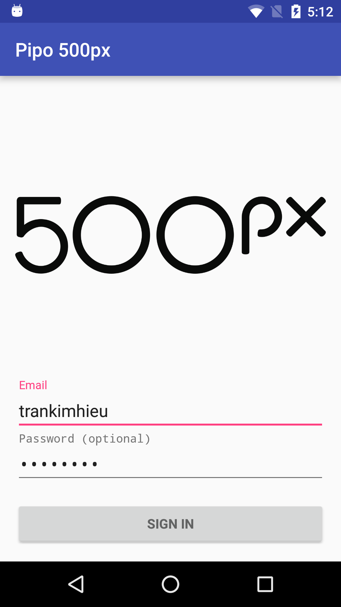
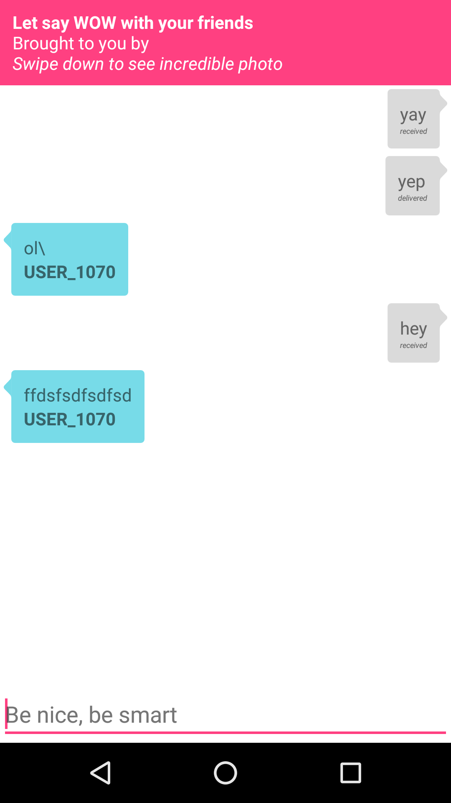

# Pipo 500px

### Requirement

#### Project Description
Create a photo viewer app which used arbitrary photo sharing service.


#### Requirements
When designing the app, keep in mind what you think is useful for the
users. Whether it’s the kind of information displayed to the user or
the overall experience, be mindful of the user. As an example, an easy
installation process could be seen as very useful for users. Going a
different direction, focusing on the app’s overall ease of use could
be seen as useful.

##### Design Implementation
There is no deadline, but ideally, the product should be completed in 2 days.
Design your app that it has two or three screens for the main feature.

#### Mobile Operating Systems
Android or iOS. Product must use either Java or Objective-C or Swift. We’d like you to use Swift if possible.

#### Presentation
- The source code should be buildable
- If your product is running on Android, send your work as an APK file
- An easy to understand description of your app

### Some thoughts when reading requirements

I take it little bit time to brainstorming about which service I will use and realize that 500px API is good one to use. They have [API Console](https://apigee.com/vova/embed/console/api500px)

But one problem is they don't use standard Multipart UPLOAD + OAuth and it takes my time to resolve problems.

I want to add chat to this app because I think it is so wonderful. It like you can say WOW with you friend real-time and hope it is an incredible feature of this app.

Now, let say about features that I worked over 72 hours

## Feature

###1. Login and OAuth to 500px API

Login need creates `token` and `token_secret`. So I use [500px Android SDK]("https://github.com/500px/500px-android-sdk") to create it with bellow code

Implement callback `XAuth500pxTask.Delegate`

```
    @Override
    public void onSuccess(AccessToken accessToken) {
        getMvpView().hideLoadingData();
        LogUtils.debug(TAG, accessToken.getToken());
        SharedPreferenceHelper.setSharedPreferenceString(ConstKV.USER_500PX_TOKEN, accessToken.getToken());
        SharedPreferenceHelper.setSharedPreferenceString(ConstKV.USER_500PX_TOKEN_SECRET, accessToken.getTokenSecret());
        new NavigationManager<MainActivity>().openActivity((Context) getMvpView(), MainActivity.class);
    }

    @Override
    public void onFail(FiveHundredException e) {
        getMvpView().hideLoadingData();
        getMvpView().showError(e.getMessage());
    }

```

and make the call

```
XAuth500pxTask loginTask = new XAuth500pxTask(this);
loginTask.execute(BuildConfig.CONSUMER_KEY, BuildConfig.CONSUMER_KEY_SECRET, email, password);
```

And after that, we need to sign OAuth every request. Because I use `Retrofit 2` so it is so easily with `interceptor`
I inject an interceptor when to create `OkHttp Client`

```
//TODO: Save it in local memory
String token = SharedPreferenceHelper.getSharedPreferenceString(ConstKV.USER_500PX_TOKEN, null);
String token_secret = SharedPreferenceHelper.getSharedPreferenceString(ConstKV.USER_500PX_TOKEN_SECRET, null);
OkHttpOAuthConsumer consumer = new OkHttpOAuthConsumer(BuildConfig.CONSUMER_KEY, BuildConfig.CONSUMER_KEY_SECRET);

consumer.setTokenWithSecret(token, token_secret);
Interceptor interceptor = new SigningInterceptor(consumer);
okHttpClientBuilder.addInterceptor(interceptor);
```

That all and from now, we can make every API call with OAuth identity


###2. Image list display

Nothing special to say here, just simply use `RecyclerView` with `Adapter` and `ViewHolder` to make it scroll more smoothly.
One more point to make it scroll more smoothly is use `Fresco` from `Facebook` [Fresco Library](http://frescolib.org) and I will talk more about it in `Technical` section.


###3. Image uploading (WIP)

Why this one has `WIP` status, because `500px Upload API` not use normal Multipart POST, they mix it with custom OAuth and it takes time, so I focus on another function first. But this `Activity` have so wonderful UX.


###4. Vote with animation

I add a small heart inside thumbnail to let user can `vote` and `unvote` a photo and it have loading indicator. It is not a big thing to say but it make users don't feel boring with this function.

###5. View image detail with zoom enabled

I load `1080` size and use `Glide` here to process image. My goal is to try to reduce disk cache space, but it take more time to processing photo.


###6. Chat with global users when viewing photo

It is one awesome feature, I think. I use Firebase to support real-time chat. And I add up delivery status functions

- Sending (on the way coming to the cloud servers)
- Delivery (on cloud and not yet come to other user phones) 
- Sent (already came to other user phones)



## Technology

This section will explain somethings cool that I use in this project.

###1. Smooth scrolling

With some first version of Android, We don't have powerful devices and many times, App crashed with `OutOfMemory` exception. In this app. I use `Fresco` and mix with `Glide` to `loading`, `caching` and `rendering` photos from CDN.

####A. Fresco

- Fresco’s image pipeline will load images from the network, local storage, or local resources. To save data and CPU, it has three levels of cache; two in memory and another in internal storage.
- Fresco’s Drawees show a placeholder for you until the image has loaded and automatically show the image when it arrives. When the image goes off-screen, it automatically releases its memory.

And it can handle `Memory`,`Loading`,`Drawing` and `Streaming` so good.

####B. Glide
Cool features from `Glide`

- Background image loading.
- Automatic job cancellation in lists where views are re-used.
- Memory and disk caching
- Bitmap and resource pooling to minimize jank.
- Arbitrary transformations.

I use `Glide` because when load `1080px` photo. It takes a lot of memory, so `Glide` will reduce it by resizing image before display.

### RxJava

Implement somewhere to make development faster and code have more semantic

RxJava + Retrofit2 (In this project it is still not used all weapon that RxJava brought to us)

```
    photoApi.getFeaturePhotos(page, feature)
            .subscribeOn(Schedulers.io())
    I    .observeOn(AndroidSchedulers.mainThread())
             .subscribe(new Subscriber<PhotoList>() {
                @Override
                public void onCompleted() {
                    getMvpView().hideLoadingData();
                }

                @Override
                public void onError(Throwable e) {
                    getMvpView().showError(e.getMessage());
                }

                @Override
                public void onNext(PhotoList photoList) {
                    getMvpView().showPhotoList(photoList);
                }
            });
```

RxBinding

Import
```
    compile 'com.jakewharton.rxbinding:rxbinding:0.4.0'
    compile 'com.jakewharton.rxbinding:rxbinding-support-v4:0.4.0'
    compile 'com.jakewharton.rxbinding:rxbinding-appcompat-v7:0.4.0'
    compile 'com.jakewharton.rxbinding:rxbinding-design:0.4.0'
    compile 'com.jakewharton.rxbinding:rxbinding-recyclerview-v7:0.4.0'
    
    // Rx Permission to deal with Android 6.0 Runtime Permission
    compile 'com.tbruyelle.rxpermissions:rxpermissions:0.7.0@aar'
```

Use it to handle with button click and RxPermission

```
        RxView.clicks(floatingActionButtonCamera)
                .compose(RxPermissions.getInstance(this).ensure(Manifest.permission.CAMERA))
                .subscribe(granted -> {
                    RxImagePicker.with(this).requestImage(Sources.CAMERA).subscribe(this::openUploadWithUri);
                });

        RxView.clicks(floatingActionButtonUpload)
                .compose(RxPermissions.getInstance(this).ensure(Manifest.permission.MANAGE_DOCUMENTS))
                .subscribe(granted -> {
                    RxImagePicker.with(this).requestImage(Sources.GALLERY).subscribe(this::openUploadWithUri);
                });

```

### UX

####1. Vote animation
Simple trick to get love from users, Don't let user confuse between loading and app crash

####2. Uploading animation


It makes they feel that they have just launched a paper plan and it so cool.

####3. Sliding up to chat
Users don't need to go to another fragment or activity to chat and easy comeback to review photo when they say WOW together about awesome photos. 

### Realtime Chat

I build it up with Firebase

FirebaseHelper
```
public class FirebaseHelper {


    private static FirebaseHelper instance;
    final String CHAT_COLLECTION = "chat";
    private Firebase firebaseClient;

    private FirebaseHelper() {
        firebaseClient = new Firebase(ChatConfig.FIREBASE_URL);
    }

    public static FirebaseHelper getInstance() {
        if (instance == null) {
            instance = new FirebaseHelper();
        }
        return instance;
    }

    public String saveChatItem(ChatItem chatItem) {
        Firebase chatCollectionRef = firebaseClient.child(CHAT_COLLECTION);
        Firebase newChatItem = chatCollectionRef.push();
        newChatItem.setValue(chatItem);
        return newChatItem.getKey();
    }

    public String saveChatItem(ChatItem chatItem, int photoId) {
        Firebase chatCollectionRef = firebaseClient.child(CHAT_COLLECTION).child(String.valueOf(photoId));
        Firebase newChatItem = chatCollectionRef.push();
        newChatItem.setValue(chatItem);
        return newChatItem.getKey();
    }

    public Firebase getChatFirebaseClient() {
        return firebaseClient.child(CHAT_COLLECTION);
    }

    public Firebase getChatFirebaseClient(int photoId) {
        return firebaseClient.child(CHAT_COLLECTION).child(String.valueOf(photoId));
    }

    public void updateChatItemStatus(ChatItem item, int photoId) {
        Firebase firebaseItem = getChatFirebaseClient(photoId).child(item.getId());
        Map<String, Object> status = new HashMap<>();
        status.put("status", item.getStatus());
        firebaseItem.updateChildren(status);
    }
}
```

ChatHelper
```
package px500.pipoask.com.helpers;

import android.content.Context;
import android.content.SharedPreferences;
import android.provider.Settings;

import com.google.gson.Gson;

import px500.pipoask.com.data.local.ConstKV;
import px500.pipoask.com.data.local.SharedPreferenceHelper;
import px500.pipoask.com.data.model.User;
import px500.pipoask.com.data.model.chat.ChatItem;

public class ChatHelper {

    public static String CHAT_STATUS_SENDING = "sending";
    public static String CHAT_STATUS_DELIVERED = "delivered";
    public static String CHAT_STATUS_RECEIVED = "received";
    private static ChatHelper instance;
    final String KEY_CHAT_USERNAME = "px500.pipoask.com.ChatUsername";
    final String KEY_CHAT_SHAREREF = "px500.pipoask.com.chat";
    String username;
    private Context context;

    private ChatHelper(Context context) {
        this.context = context;
        username = getChatUsername();
    }

    public static ChatHelper getInstance(Context context) {
        if (instance == null) {
            instance = new ChatHelper(context);
        }
        return instance;
    }

    private static String getDeviceId(Context context) {
        return Settings.Secure.getString(context.getContentResolver(), Settings.Secure.ANDROID_ID);
    }

    public String getChatUsername() {
        String userJson = SharedPreferenceHelper.getSharedPreferenceString(ConstKV.USER_500PX_INFO, "");

        if (!userJson.isEmpty()) {
            Gson gson = new Gson();
            User user = gson.fromJson(userJson, User.class);
            username = user.username;
            saveCreatedUsername(username);
            return user.username;
        } else {
            String username = getCreatedUsername();
            if (username.equals("")) {
                String deviceId = ChatHelper.getDeviceId(context);
                String substr = deviceId.substring(deviceId.length() - 4);
                username = "USER_" + substr;
                saveCreatedUsername(username);
            }
            return username;
        }
    }

    public boolean isFromThisUser(ChatItem item) {
        return item.getUsername().equals(username);
    }

    private String getCreatedUsername() {
        Context context = this.context;
        SharedPreferences sharedPref = context.getSharedPreferences(
                KEY_CHAT_SHAREREF, Context.MODE_PRIVATE);
        return sharedPref.getString(KEY_CHAT_USERNAME, "");
    }

    private void saveCreatedUsername(String username) {
        Context context = this.context;
        SharedPreferences sharedPref = context.getSharedPreferences(
                KEY_CHAT_SHAREREF, Context.MODE_PRIVATE);
        SharedPreferences.Editor editor = sharedPref.edit();
        editor.putString(KEY_CHAT_USERNAME, username);
        editor.apply();
    }


}
```


FirebaseChildEventListener
```
    FirebaseHelper.getInstance().getChatFirebaseClient(photoId).addChildEventListener(new ChildEventListener() {
            @Override
            public void onChildAdded(DataSnapshot dataSnapshot, String s) {
                ChatItem tempItem = new ChatItem(dataSnapshot);

                if (ChatHelper.getInstance(PhotoActivity.this).isFromThisUser(tempItem)) {
                    if (tempItem.getStatus().equals(ChatHelper.CHAT_STATUS_SENDING)) {
                        tempItem.setStatus(ChatHelper.CHAT_STATUS_DELIVERED);
                        FirebaseHelper.getInstance().updateChatItemStatus(tempItem, photoId);
                    }
                } else {
                    tempItem.setStatus(ChatHelper.CHAT_STATUS_RECEIVED);
                    FirebaseHelper.getInstance().updateChatItemStatus(tempItem, photoId);
                }

                ChatItem item = ChatListHelper.findItem(chatItemList, tempItem);
                if (item == null) {
                    chatItemList.add(tempItem);
                }
                adapter.notifyDataSetChanged();
                listViewChatContent.smoothScrollToPosition(adapter.getCount() - 1);
            }

            @Override
            public void onChildChanged(DataSnapshot dataSnapshot, String s) {
                ChatItem tempItem = new ChatItem(dataSnapshot);
                ChatItem item = ChatListHelper.findItem(chatItemList, tempItem);
                if (item == null) {
                    chatItemList.add(tempItem);

                } else {
                    item.setStatus(tempItem.getStatus());
                    item.setUsername(tempItem.getUsername());
                    item.setMessage(tempItem.getMessage());
                }
                adapter.notifyDataSetChanged();
            }

            @Override
            public void onChildRemoved(DataSnapshot dataSnapshot) {

            }

            @Override
            public void onChildMoved(DataSnapshot dataSnapshot, String s) {

            }

            @Override
            public void onCancelled(FirebaseError firebaseError) {

            }
        });
```

### CI

I use Travis CI and although not implement any useful test but it will be added up later.
[https://travis-ci.org/trankimhieu/Pipo-500px](https://travis-ci.org/trankimhieu/Pipo-500px)

## Next version

- Finish upload feature
- Add current user profile
- Add get comments from 500px
- Get view by collection
...